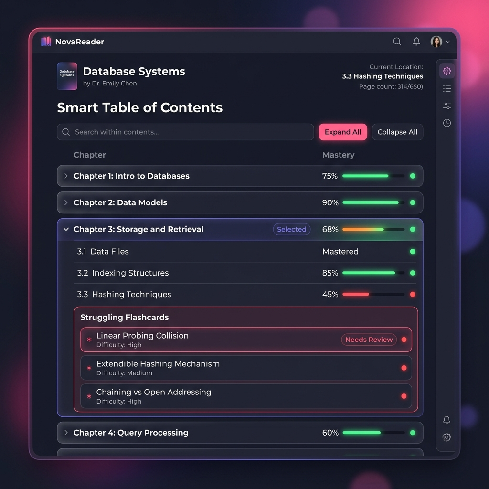
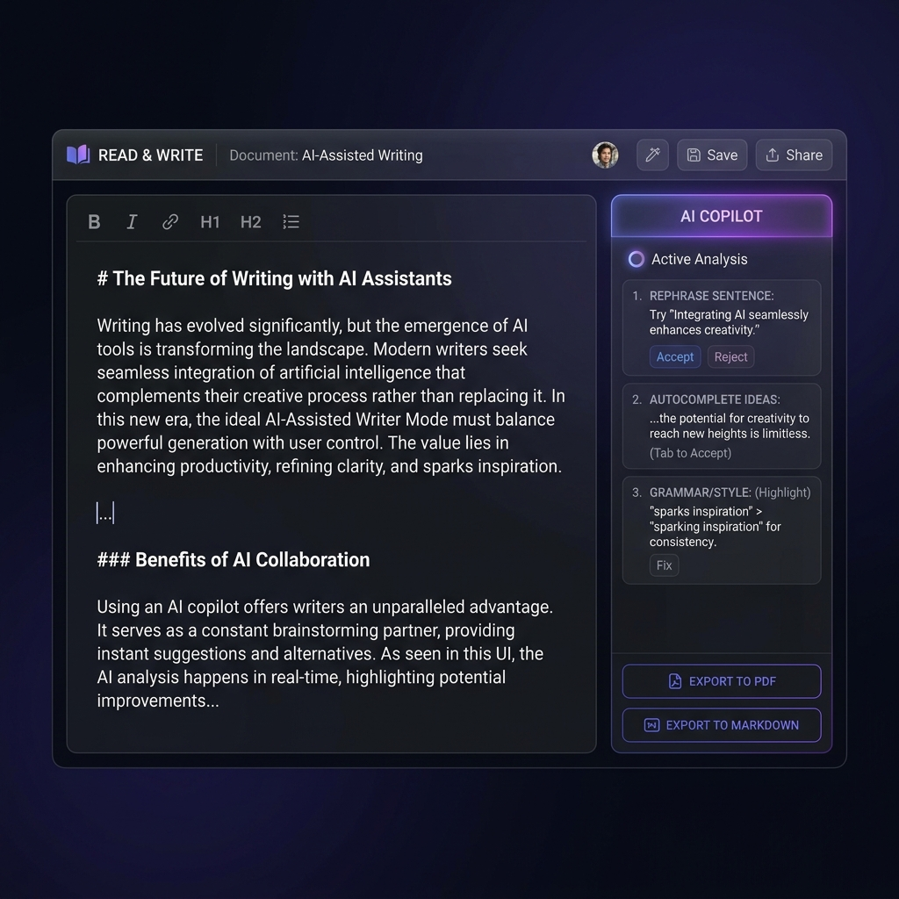

# Макеты системы "Граф Знаний"

Здесь собраны визуальные референсы для будущего обновления приложения.

## 1. Интерактивный Граф Знаний (Network View)

**Ключевые элементы UI:**
*   **Сетка графа (Центр):** Динамический граф сущностей (например, из книги "Designing Data-Intensive Applications"). 
*   **Цветовое кодирование (Heatmap):** 
    *   🟢 Зеленые узлы — отлично усвоенный материал.
    *   🟡 Желтые узлы — в процессе изучения.
    *   🔴 Красные узлы — проблемные зоны (много ошибок в квизах).
*   **Боковая панель Инспектора (Справа):** Открывается при клике на конкретный узел. Содержит ИИ-выжимку (Summary), список всех связанных хайлайтов из книги и кнопку быстрого старта практики по карточкам (Practice Flashcards).

---

## 2. Умное Оглавление с Тепловой Картой (Smart TOC)

**Ключевые элементы UI:**
*   **Прогресс-бары (Mastery):** Напротив каждой главы и секции показан визуальный индикатор уровня усвоения материала (зеленый/желтый/красный).
*   **Раскрывающиеся проблемные зоны:** Внутри 3-й главы раскрыта красная секция, которая сразу показывает конкретные флешкарты (Struggling Flashcards), в которых пользователь ошибался чаще всего.
*   **Дизайн:** Использование стекломорфизма (glassmorphism) и неоновых акцентов для премиального вида приложения.

---

## 3. Режим "AI-Писатель" (AI-Assisted Writer)

**Ключевые элементы UI:**
*   **Чистый редактор (Слева 70%):** Полноценный Markdown/WYSIWYG редактор для написания собственных статей или конспектов. Дизайн минималистичный, ничего не отвлекает. Поддержка заголовков, списков, жирного шрифта.
*   **AI Copilot (Справа 30%):** Сайдбар ИИ-редактора, который анализирует текст в реальном времени. Показывает:
    *   Предложения по перефразированию предложений.
    *   Идеи автодополнения (по нажатию `Tab`).
    *   Поиск стилистических или грамматических ошибок.
*   **Кнопки экспорта (Внизу справа):** В один клик можно сгенерировать PDF сверстанной статьи или выгрузить чистый Markdown (для Notion или Obsidian).
